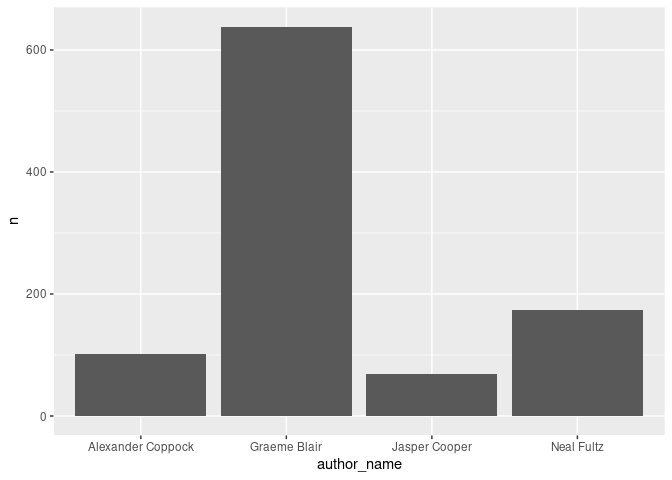

<!-- README.md is generated from README.Rmd. Please edit that file -->

# askgit

<!-- badges: start -->
<!-- badges: end -->

This is a very quick DBI wrapper around the most excellent
[askgit](https://github.com/askgitdev/askgit) program, which has an
undocumented SQLite extension mode.

**WIP / DO NOT USE FOR CRITICAL JOBS**

## Installation

Ideally one could install the development version of the askgit DBI
wrapper via:

``` r
remotes::install_github("nfultz/askgitdbi")
```

However, I have no idea if it would work with submodules. Also you need
the appropriate golang tools as well as libgit2.

## Example

This is a basic example which shows you how to query a repo:

``` r
library(DBI)

con <- dbConnect(askgit::AskGit(), ":memory:")


dbGetQuery(con, "select hash, author_name from commits order by committer_when desc limit 3")
#>                                       hash author_name
#> 1 6c1eab49cd4661226c464924c499cf7be6737337  Neal Fultz
```

The below is a less contrived example:

``` r
require(ggplot2)
#> Loading required package: ggplot2

"select author_name, count(hash) as n 
from commits('../DeclareDesign') 
where message not like 'Merge%' 
group by 1 
order by 2 desc 
limit 4" |>
dbGetQuery(conn=con) |>
ggplot() + aes(x=author_name, y=n) + geom_col()
```


